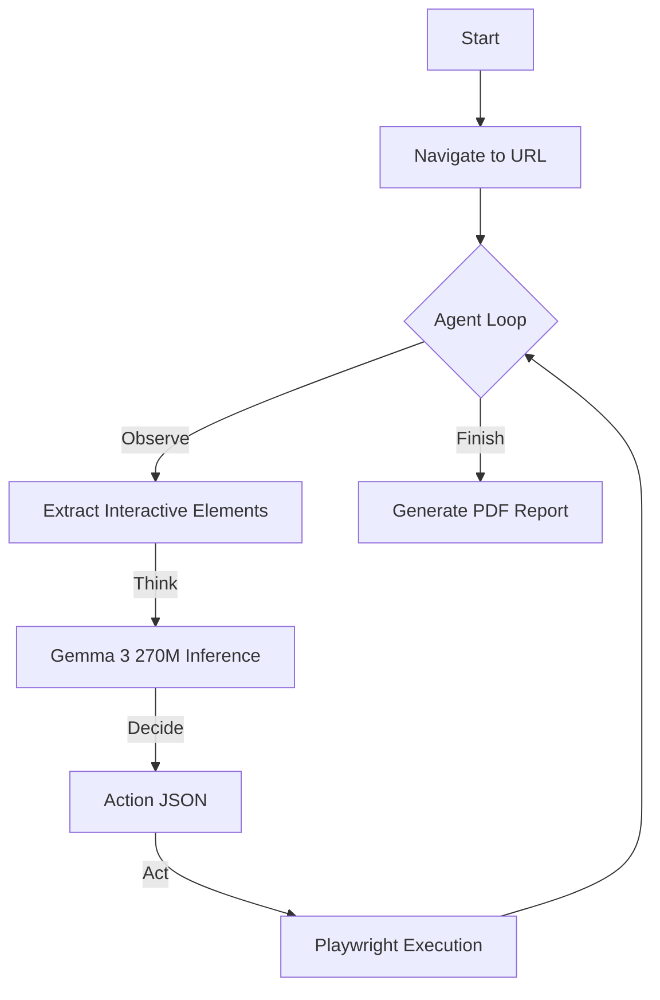

# 🤖 AI Agent & Web Navigator in GitHub Actions


A powerful suite of AI-powered GitHub Actions to run **Google's Gemma 3 270M** model and **Autonomous Web Agents** directly in your CI/CD pipelines. Optimized for standard GitHub-hosted runners using `llama.cpp` and `uv` for lightning-fast inference.

## ✨ Features

- **🧠 On-Device AI**: Run the ultra-compact Gemma 3 270M model directly in GitHub Actions (CPU-optimized).
- **🕸️ Autonomous Web Agent**: A Playwright-powered agent that can navigate, click, type, and summarize web content based on natural language instructions.
- **⚡ Fast Setup**: Built with `uv` for instant environment creation and caching.
- **📄 Smart Reporting**: Generates detailed PDF reports with screenshots of the agent's journey.
- **🔄 Agentic Loop**: Uses an observation-thought-action loop to handle complex multi-step tasks.

## 🚀 Quick Start

### 1. Web Navigator Agent (New!)

Use the agent to navigate websites, login to portals, or summarize content.

```yaml
steps:
  - name: Run Web Navigator Agent
    uses: harshityadav95/LLM-Model-in-Github-Action/web-navigator-action@main
    with:
      website_url: 'https://example.com/login'
      user_instruction: 'Login with user "demo" and password "1234", then summarize the dashboard.'
      model: 'gemma-3-270m-it'
      hf_token: ${{ secrets.HF_TOKEN }} # (Optional) Required for gated models
```

### 2. Standard Model Inference

Run simple prompts against the model.

```yaml
steps:
  - name: Run Gemma Inference
    uses: harshityadav95/LLM-Model-in-Github-Action@main
    with:
      model: 'gemma-3-270m'
      query: 'Explain quantum computing in one sentence.'
```

## 🛠️ Actions Available

### 🌐 `web-navigator-action`

An autonomous agent that controls a headless browser.

| Input | Description | Required | Default |
|-------|-------------|----------|---------|
| `website_url` | The starting URL for the agent. | ✅ | - |
| `user_instruction` | Natural language instruction (e.g., "Find the pricing page"). | ✅ | - |
| `model` | Model variant. Recommended: `gemma-3-270m-it`. | ✅ | `gemma-3-270m-it` |
| `hf_token` | Hugging Face Access Token for downloading models. | ❌ | - |

**Output Artifacts**:
- `agent_report.pdf`: A visual report containing screenshots of every step and a final summary.

### 🧠 `LLM-Model-in-Github-Action` (Root Action)

Direct interface to the LLM for text generation tasks.

| Input | Description | Required | Default |
|-------|-------------|----------|---------|
| `query` | The prompt to send to the LLM. | ✅ | - |
| `model` | `gemma-3-270m` or `gemma-3-270m-it`. | ✅ | `gemma-3-270m` |
| `hf_token` | Hugging Face Token (if using non-public models). | ❌ | - |

## 🏗️ Technical Architecture

### Web Agent Pipeline
The **Web Navigator Agent** uses a closed-loop system to interact with the web:



1.  **Observation**: The agent injects unique IDs into the DOM to identify interactive elements (buttons, inputs, links).
2.  **Reasoning**: It sends a simplified representation of the page state to Gemma 3 270M.
3.  **Action**: The model replies with a JSON command (e.g., `{"action": "click", "element_id": "15"}`).
4.  **Execution**: Playwright executes the action and captures a screenshot.

## 🤝 Contributing

We welcome contributions! Please see [WEB_NAVIGATION_GUIDE.md](WEB_NAVIGATION_GUIDE.md) for deeper technical details.

1.  Fork the repo.
2.  Create a branch for your feature.
3.  Submit a Pull Request.

## 📄 License

MIT License. See [LICENSE](LICENSE) for details.

---
*Built with ❤️ using [llama.cpp](https://github.com/abetlen/llama-cpp-python), [uv](https://github.com/astral-sh/uv), [Playwright](https://playwright.dev), and Google Gemma.*
